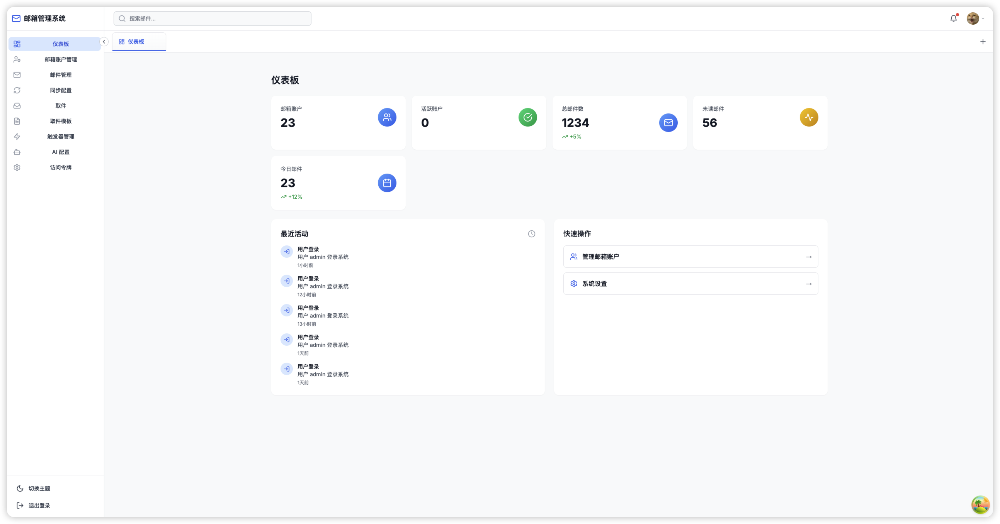
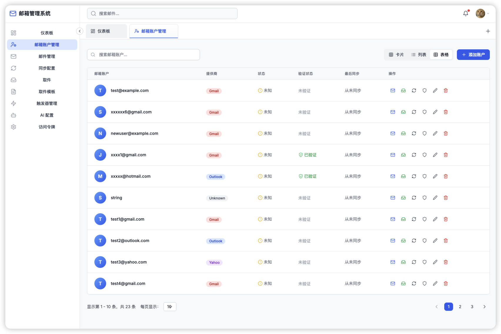
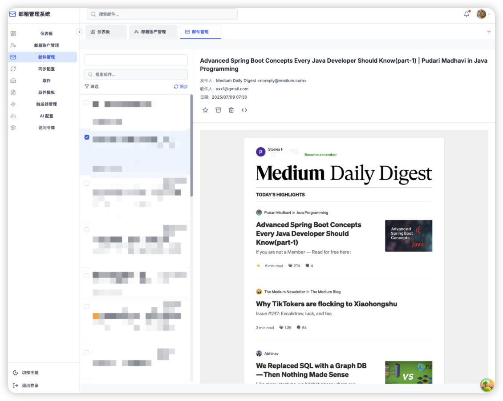
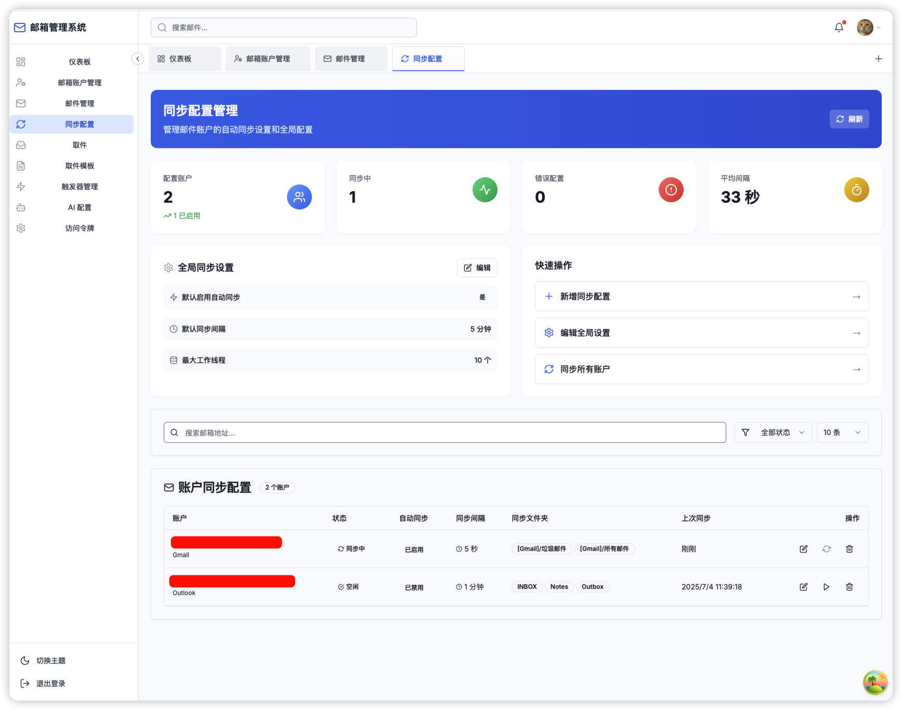
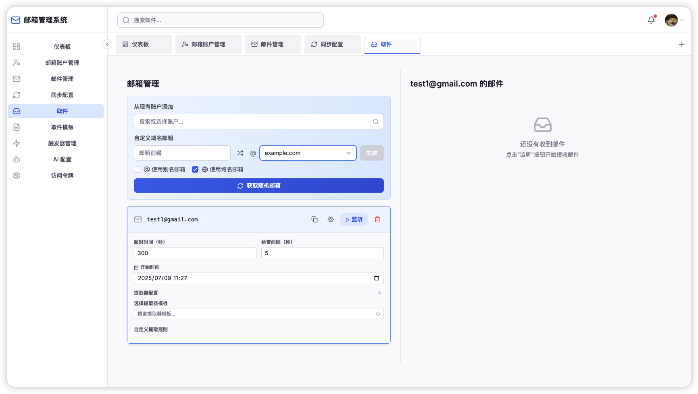
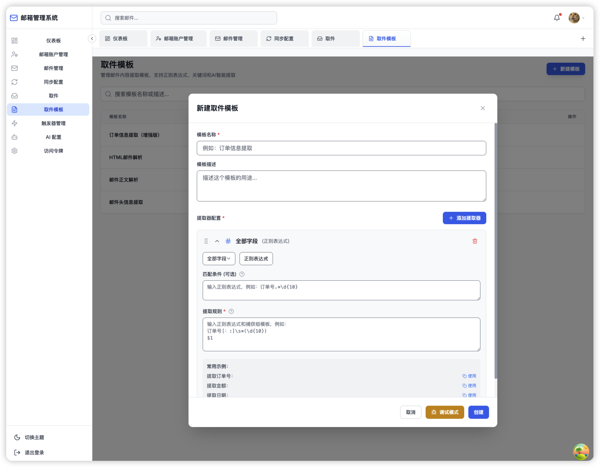
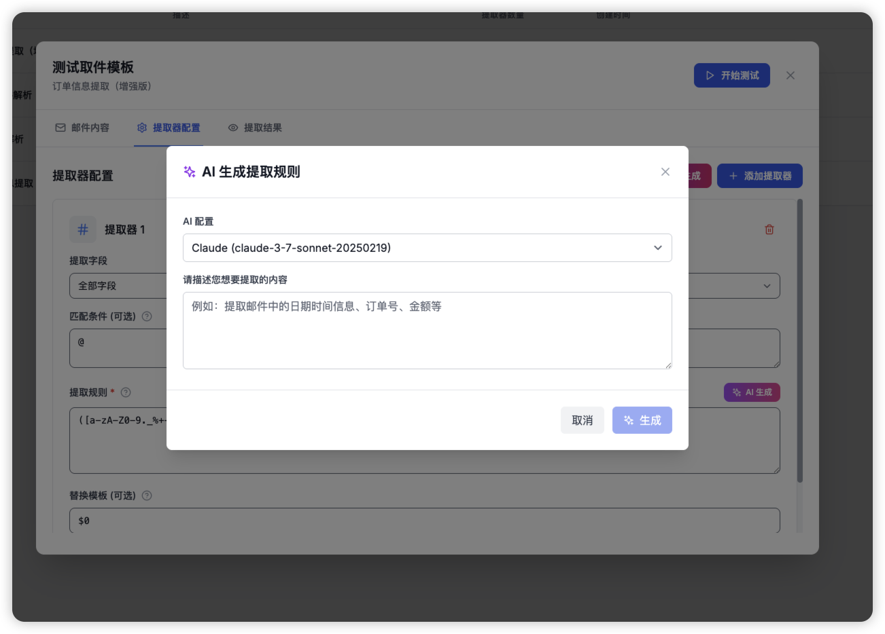

# Mailman - 智能邮件管理系统

[](https://opensource.org/licenses/Apache-2.0)
[](https://golang.org)
[](https://nextjs.org)
[](https://www.typescriptlang.org)

Mailman 是一个功能强大的现代化邮件管理系统，提供邮件同步、智能解析、触发器自动化和AI助手等功能。支持多种邮件协议，具有直观的Web界面和强大的后端API。

## 🚀 主要特性

### 📧 邮件管理

- **多账户支持**：管理多个邮件账户（Gmail、Outlook、IMAP等）
- **实时同步**：自动同步邮件，支持增量同步
- **智能解析**：自动解析邮件内容，提取关键信息
- **邮件搜索**：强大的邮件搜索和过滤功能

### 🤖 AI集成

- **OpenAI集成**：支持GPT模型进行邮件内容分析
- **智能提取**：使用AI提取邮件中的结构化数据
- **自动分类**：基于AI的邮件自动分类
- **内容摘要**：生成邮件内容摘要

### ⚡ 自动化功能

- **触发器系统**：基于条件的邮件处理自动化
- **定时任务**：邮件同步和处理的定时调度
- **事件监听**：实时监听邮件事件
- **工作流管理**：复杂的邮件处理工作流

### 🛡️ 安全特性

- **用户认证**：安全的用户登录和会话管理
- **OAuth2支持**：支持OAuth2邮件账户授权
- **数据加密**：敏感数据加密存储
- **权限控制**：细粒度的权限管理

## 🏗️ 技术架构

### 后端技术栈

- **语言**：Go 1.23+
- **框架**：Gorilla Mux
- **数据库**：MySQL 8.0 + GORM
- **文档**：Swagger/OpenAPI
- **实时通信**：WebSocket
- **邮件协议**：IMAP, SMTP

### 前端技术栈

- **框架**：Next.js 14.0+
- **语言**：TypeScript 5.3+
- **样式**：Tailwind CSS
- **UI组件**：Radix UI, Headless UI
- **状态管理**：Zustand
- **HTTP客户端**：Axios + React Query
- **动画**：Framer Motion

### 部署与运维

- **容器化**：Docker + Docker Compose
- **反向代理**：Nginx
- **监控**：活动日志系统
- **健康检查**：Docker健康检查

## 📱 界面预览

### 主界面



### 邮件账户管理



## 邮件管理



## 同步配置



<!-- ### 触发器配置 -->

## 邮件监听和提取



## 邮件取件模板



### AI助手



## 🚀 快速开始

### 环境要求

- **Go**: 1.23+
- **Node.js**: 18+
- **MySQL**: 8.0+
- **Docker**: 最新版本（推荐）
- **Docker Compose**: 最新版本

### 使用Docker Compose部署（推荐）

1. **克隆项目**

```bash
git clone https://github.com/seongminhwan/mailman.git
cd mailman
```

2. **配置环境变量**

```bash
cp .env.example .env
# 编辑.env文件，设置必要的环境变量
```

3. **启动服务**

```bash
docker-compose up -d
```

4. **访问应用**

- 前端界面：http://localhost:80
- 后端API：http://localhost:8080
- API文档：http://localhost:8080/swagger/index.html

### 本地开发部署

#### 后端部署

1. **进入后端目录**

```bash
cd backend
```

2. **安装依赖**

```bash
go mod download
```

3. **配置数据库**

```bash
# 启动MySQL数据库
docker run -d --name mailman-mysql \
  -e MYSQL_ROOT_PASSWORD=rootpassword \
  -e MYSQL_DATABASE=mailman \
  -e MYSQL_USER=mailman \
  -e MYSQL_PASSWORD=mailmanpassword \
  -p 3306:3306 \
  mysql:8.0
```

4. **设置环境变量**

```bash
export DB_HOST=localhost
export DB_PORT=3306
export DB_USER=mailman
export DB_PASSWORD=mailmanpassword
export DB_NAME=mailman
export OPENAI_API_KEY=your-openai-api-key  # 可选
```

5. **运行后端服务**

```bash
go run cmd/mailman/main.go
```

#### 前端部署

1. **进入前端目录**

```bash
cd frontend
```

2. **安装依赖**

```bash
npm install
```

3. **配置环境变量**

```bash
cp .env.local.example .env.local
# 编辑.env.local文件设置API地址
```

4. **启动开发服务器**

```bash
npm run dev
```

### 生产环境部署

1. **构建前端**

```bash
cd frontend
npm run build
```

2. **构建后端**

```bash
cd backend
go build -o mailman cmd/mailman/main.go
```

3. **使用生产配置**

```bash
docker-compose -f docker-compose.yml up -d
```

## ⚙️ 配置说明

### 环境变量

#### 数据库配置

```env
DB_DRIVER=mysql
DB_HOST=localhost
DB_PORT=3306
DB_USER=mailman
DB_PASSWORD=mailmanpassword
DB_NAME=mailman
DB_SSLMODE=disable
```

#### OpenAI配置（可选）

```env
OPENAI_API_KEY=your-openai-api-key
OPENAI_BASE_URL=https://api.openai.com/v1
OPENAI_MODEL=gpt-3.5-turbo
```

#### 服务器配置

```env
SERVER_HOST=0.0.0.0
SERVER_PORT=8080
LOG_LEVEL=INFO
```

### 邮件账户配置

支持的邮件协议：

- **IMAP**: Gmail, Outlook, Yahoo Mail等
- **Exchange**: Microsoft Exchange Server
- **POP3**: 传统POP3协议

配置示例：

```json
{
  "provider": "gmail",
  "email": "user@gmail.com",
  "password": "app-password",
  "imap_host": "imap.gmail.com",
  "imap_port": 993,
  "smtp_host": "smtp.gmail.com",
  "smtp_port": 587,
  "use_tls": true
}
```

## 📚 API文档

### Swagger文档

启动后端服务后，可访问：

- **URL**: http://localhost:8080/swagger/index.html
- **格式**: OpenAPI 3.0

### 主要API端点

#### 认证相关

- `POST /api/auth/login` - 用户登录
- `POST /api/auth/logout` - 用户登出
- `GET /api/auth/user` - 获取用户信息

#### 邮件账户

- `GET /api/accounts` - 获取邮件账户列表
- `POST /api/accounts` - 添加邮件账户
- `PUT /api/accounts/{id}` - 更新邮件账户
- `DELETE /api/accounts/{id}` - 删除邮件账户

#### 邮件管理

- `GET /api/emails` - 获取邮件列表
- `GET /api/emails/{id}` - 获取邮件详情
- `POST /api/emails/sync` - 同步邮件
- `POST /api/emails/search` - 搜索邮件

#### 触发器

- `GET /api/triggers` - 获取触发器列表
- `POST /api/triggers` - 创建触发器
- `PUT /api/triggers/{id}` - 更新触发器
- `DELETE /api/triggers/{id}` - 删除触发器

#### AI功能

- `POST /api/ai/extract` - AI内容提取
- `POST /api/ai/classify` - AI邮件分类
- `POST /api/ai/summarize` - AI内容摘要

## 🔧 功能使用指南

### 添加邮件账户

1. 登录系统后，点击"账户管理"
2. 点击"添加账户"按钮
3. 选择邮件提供商（Gmail、Outlook等）
4. 输入邮件地址和认证信息
5. 测试连接并保存


<!-- ### 创建触发器

1. 进入"触发器管理"页面
2. 点击"创建触发器"
3. 设置触发条件（发件人、主题、内容等）
4. 配置执行动作（转发、标记、API调用等）
5. 测试并启用触发器 -->

<!-- 截图位置：创建触发器的配置界面 -->

<!-- ### 使用AI功能

1. 在邮件详情页面，点击"AI助手"
2. 选择功能（提取、分类、摘要等）
3. 配置AI参数和提示模板
4. 执行AI分析并查看结果 -->

<!-- 截图位置：AI功能使用界面 -->


## 🛠️ 开发指南

### 项目结构

```ini
mailman/
├── backend/                 # 后端服务
│   ├── cmd/                # 应用入口
│   ├── internal/           # 内部包
│   │   ├── api/           # API处理器
│   │   ├── config/        # 配置管理
│   │   ├── database/      # 数据库连接
│   │   ├── models/        # 数据模型
│   │   ├── repository/    # 数据访问层
│   │   ├── services/      # 业务逻辑层
│   │   └── utils/         # 工具函数
│   ├── docs/              # API文档
│   └── scripts/           # 辅助脚本
├── frontend/               # 前端应用
│   ├── src/
│   │   ├── app/           # Next.js应用路由
│   │   ├── components/    # React组件
│   │   ├── contexts/      # React上下文
│   │   ├── lib/           # 工具库
│   │   ├── services/      # API服务
│   │   ├── styles/        # 样式文件
│   │   └── types/         # TypeScript类型
│   └── public/            # 静态资源
└── docker-compose.yml     # Docker编排
```

### 开发环境设置

1. **安装开发工具**

```bash
# Go开发工具
go install github.com/swaggo/swag/cmd/swag@latest
go install github.com/cosmtrek/air@latest

# 前端开发工具
npm install -g @next/codemod
```

2. **生成API文档**

```bash
cd backend
swag init -g cmd/mailman/main.go
```

3. **热重载开发**

```bash
# 后端热重载
cd backend
air

# 前端热重载
cd frontend
npm run dev
```

### 代码规范

- **Go代码**: 遵循Go标准代码规范
- **TypeScript**: 使用ESLint和Prettier
- **提交规范**: 使用Conventional Commits

### 测试

```bash
# 后端测试
cd backend
go test ./...

# 前端测试
cd frontend
npm test
```

## 📋 待办事项

- [ ] 邮件附件管理
- [ ] 邮件模板系统
- [ ] 批量操作功能
- [ ] 移动端支持
- [ ] 多语言支持
- [ ] 数据导出功能
- [ ] 高级搜索功能
- [ ] 邮件加密支持

## 🤝 贡献指南

1. Fork项目
2. 创建特性分支 (`git checkout -b feature/AmazingFeature`)
3. 提交更改 (`git commit -m 'Add some AmazingFeature'`)
4. 推送分支 (`git push origin feature/AmazingFeature`)
5. 创建Pull Request

## 📜 许可证

本项目采用Apache 2.0许可证。详情请参阅 [LICENSE](LICENSE) 文件。

## 🆘 支持

如果您遇到问题或需要帮助，请：

1. 查看[问题跟踪器](https://github.com/seongminhwan/mailman/issues)
2. 阅读[FAQ文档](docs/FAQ.md)
3. 联系维护者

## 📞 联系信息

- **项目主页**: https://github.com/seongminhwan/mailman
- **问题报告**: https://github.com/seongminhwan/mailman/issues
- **邮件**: support@mailman.com

---

**Mailman** - 让邮件管理更智能、更高效！ 🚀